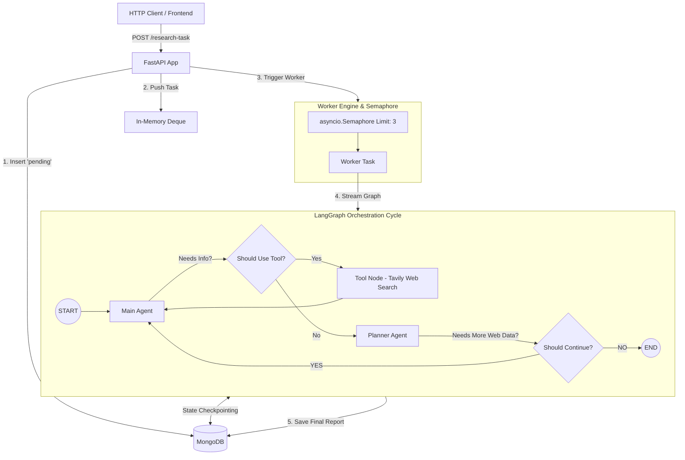

# Building an Autonomous AI Research Agent with LangGraph, FastAPI, and Bounded Concurrency

Autonomous AI agents are transforming how we gather, analyze, and synthesize web information. Instead of relying on a single prompt-response LLM call, modern agentic systems construct multi-node execution loops—iteratively searching the web, evaluating progress, and synthesizing detailed research reports.

In this technical deep dive, we’ll explore the architecture and implementation of an end-to-end autonomous **AI Research Agent** built using **LangGraph**, **FastAPI**, **MongoDB**, and **Tavily Web Search**. We will cover the state machine graph design, persistence checkpointers, asynchronous background queuing, and worker concurrency controls.

---

## Architecture Overview

The system consists of three primary layers:

1. **API & Queue Layer (`FastAPI` + `collections.deque`)**: Ingests user research tasks, persists initial metadata, and enqueues tasks for background processing.
2. **Concurrency & Worker Engine (`asyncio.Semaphore`)**: Throttles parallel task execution using asynchronous worker limits.
3. **Orchestration Graph (`LangGraph` + `MongoDB Checkpointer`)**: Executes an iterative state machine comprising a **Main Agent**, a **Tool Node**, and a **Planner Agent**.



---

## 1. The Multi-Agent Graph Loop (LangGraph)

The core brain of the application is built with **LangGraph**, a framework for building stateful, multi-actor applications with LLMs.

### State Schema & Thread Isolation

All nodes pass around a shared state containing the conversation history:

```python
class State(TypedDict):
    messages: Annotated[list, add_messages]
```

To preserve state history and allow state inspection across multi-turn sessions, the graph is compiled with a `MongoDBSaver` checkpointer using a unique `thread_id` for every research task:

```python
checkpointer = MongoDBSaver(
    client=sync_client,
    mongo_client=sync_client,
    db_name="user_app",
    collection_name="research_tasks"
)

workflow = graph.compile(checkpointer=checkpointer)
```

### Node Roles

1. **Main Agent (`MainAgent`)**: 
   Bound with the `web_search` tool. It analyzes the research prompt and decides whether to issue web search queries using Tavily or provide a comprehensive report based on gathered information.

2. **Tool Node (`Tools`)**: 
   An automated `ToolNode` that intercepts tool call requests emitted by the `MainAgent`, executes web searches via the Tavily API, and returns search result payloads back to the graph state.

3. **Planner Agent (`PlannerAgent`)**:
   Acts as a quality control inspector. It reviews the conversation and web search results, outputting `YES` if crucial information is still missing, or `NO` if enough evidence has been collected to terminate the research cycle.

### Dynamic Routing & Conditional Edges

The graph routes execution dynamically based on node output:

```python
# Route after Main Agent
graph.add_conditional_edges(
    "Main",
    should_use_tool,
    {
        "tools": "Tools",
        "planner": "Planner"
    }
)

# Route after Tool Execution
graph.add_edge("Tools", "Main")

# Route after Planner Evaluation
graph.add_conditional_edges(
    "Planner",
    should_continue,
    {
        "main": "Main",
        "end": END
    }
)
```

---

## 2. Asynchronous Queue & Concurrency Management

When building AI agents in production, sending unthrottled API requests directly to LLM providers or search engines will quickly hit rate limits or exhaust server memory.

### Bounded Parallel Execution with `asyncio.Semaphore`

To support concurrent request processing while maintaining predictable resource limits, the worker engine uses an asynchronous `Semaphore`:

```python
MAX_CONCURRENT_TASKS = 3
semaphore = asyncio.Semaphore(MAX_CONCURRENT_TASKS)
```

### Non-Blocking Queue Processor

1. Incoming requests append task payloads to an in-memory `deque`.
2. `process_research_tasks()` pops items from the queue using atomic `.popleft()` calls.
3. Each task is spawned inside an independent `asyncio.create_task()`, acquiring a slot in the semaphore:

```python
async def run_single_task(item):
    async with semaphore:
        task_id = item["_id"]
        
        # 1. Update status to 'in-progress'
        await research_task_collection.update_one(
            {"_id": task_id},
            {"$set": {"status": "in-progress"}}
        )

        final_answer = ""
        
        # 2. Stream graph execution
        async for state in workflow.astream(..., config):
            # ... process state and extract report text ...

        # 3. Persist final report and update status
        await research_task_collection.update_one(
            {"_id": task_id},
            {"$set": {"status": "completed", "research_data": final_answer}}
        )

async def process_research_tasks():
    while enqueue1:
        try:
            item = enqueue1.popleft()
        except IndexError:
            break

        asyncio.create_task(run_single_task(item))
```

---

## 3. Data Cleansing & Output Filtering

During graph streaming (`workflow.astream()`), nodes emit various message types:
- `Main` node output (Text responses or tool call specs)
- `Tools` node output (JSON search result payloads)
- `Planner` node output (`YES` or `NO` decision tokens)

To ensure that MongoDB stores only the **final synthesized research report** (and filters out tool JSON strings and planner evaluation tokens), the system applies explicit node-level message filtering:

```python
for node, data in state.items():
    for message in data.get("messages", []):
        # Extract research text strictly from MainAgent without tool calls
        if node == "Main" and not getattr(message, "tool_calls", None):
            content = message.content
            if isinstance(content, str):
                text = content.strip()
            elif isinstance(content, list):
                # Extract text blocks if content is multi-modal or structured
                text_parts = [
                    part if isinstance(part, str) else str(part.get("text", ""))
                    for part in content
                ]
                text = "\n".join(text_parts).strip()
            else:
                text = str(content).strip()

            if text:
                final_answer = text
```

This guarantees that the document stored in MongoDB contains a clean Markdown report string:

```json
{
  "_id": "6abd229344f9bc2893e13604",
  "status": "completed",
  "task": "Analyze the global AI coding-agent market from 2024-2026",
  "research_data": "# Executive Summary\n\nThe market shifted from AI autocomplete..."
}
```

---

## 4. Task Lifecycle & Error Resilience

Every research task follows a deterministic state machine lifecycle saved in MongoDB:

```
[ pending ] ──► [ in-progress ] ──┬──► [ completed ] (Report saved)
                                  └──► [ failed ]    (Error logged)
```

If an exception occurs during LLM reasoning, web search timeouts, or network drops, the exception is caught within the task wrapper, ensuring that:
1. The specific task status is updated to `failed` with the error message.
2. The `semaphore` slot is safely released so remaining queue items continue processing.
3. The API server remains healthy without unhandled background task crashes.

---

## Summary

Combining **LangGraph** with an **Asyncio Worker Queue** provides a clean architecture for building autonomous research agents:

- **State Machine Control**: `LangGraph` decouples reasoning (`Main`), action (`Tools`), and evaluation (`Planner`).
- **State Checkpointing**: `MongoDBSaver` guarantees persistence and thread isolation across research sessions.
- **Resource Control**: `asyncio.Semaphore` prevents API rate limit exhaustion by enforcing a strict concurrency threshold.
- **Output Hygiene**: Filtering graph state outputs yields clean, structured Markdown reports for end users.
